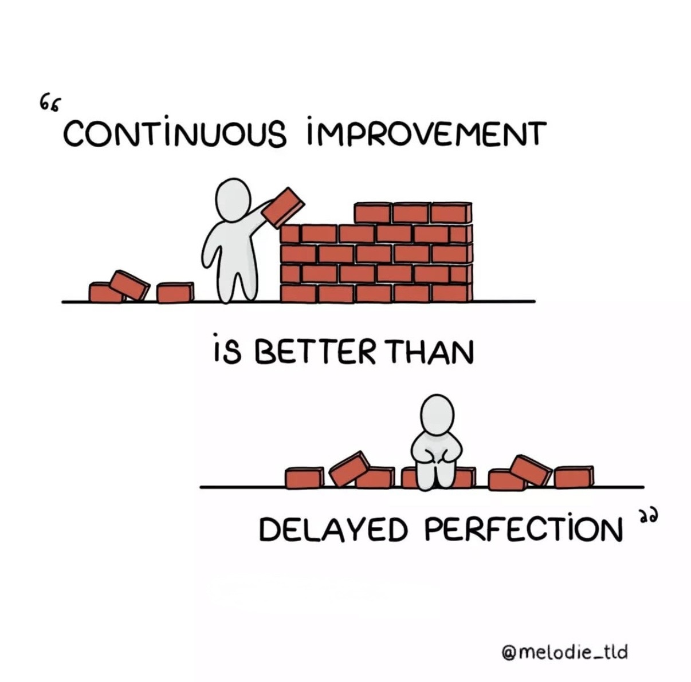

<!-- Profile Header -->
<h1 align="center">Hi there 👋, I'm Bobi</h1>
<h3 align="center">💻 Software Engineer | 🚀 Lifelong Learner | 🌐 Based in Indonesia</h3>

  

### 🔍 About Me

- 📱 &nbsp; Passionate about **Mobile App Development**
- 🖥️ &nbsp; Currently building apps using **Flutter**
- 🌱 &nbsp; Exploring the backend with **PHP & Laravel**
- 🤝 &nbsp; Open for collaboration & freelance work
- 📬 &nbsp; Reach me at [bobipermana17@gmail.com](mailto:bobipermana17@gmail.com) || [LinkedIn](https://www.linkedin.com/in/bobipermanasandi)

---

### ⚒️ Tech Stack & Tools

  
  
  
  
  
  
  

### 📊 Github Statistic

### 🌐 GitHub Activity Graph  

  

---

### 💬 Quote at the moment

> *"Continuous improvement is better than delayed perfection."*  
> — [Mélodie | Visual Ideas](https://x.com/melodie_tld/status/1549023788330893313)

<!-- Feel free to remove this footer if you prefer a cleaner look -->

  Made with ❤️ by CodeSynesia • Powered by curiosity and grass jelly cappuccino ☕

